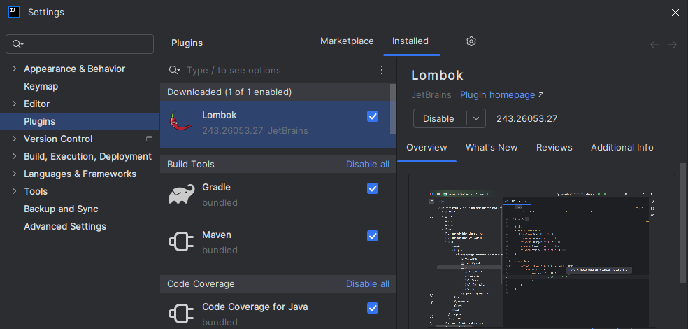
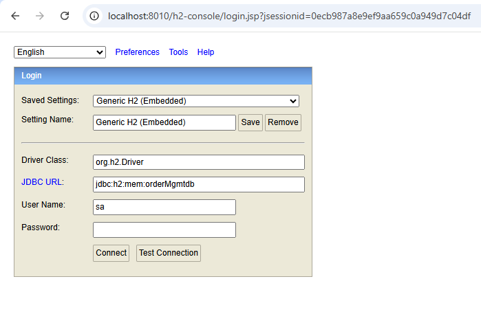
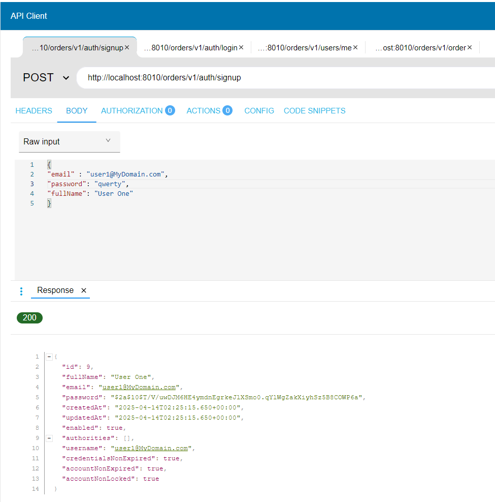
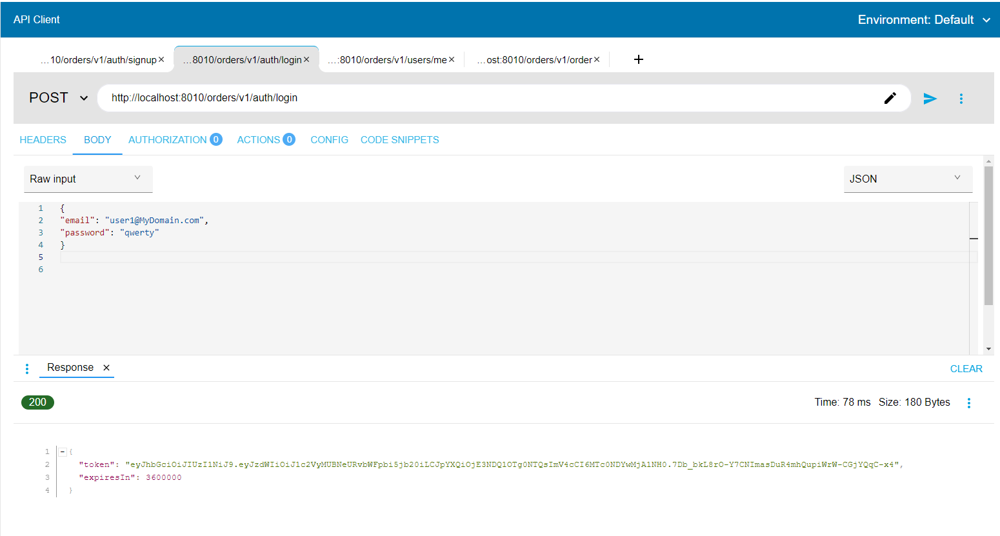
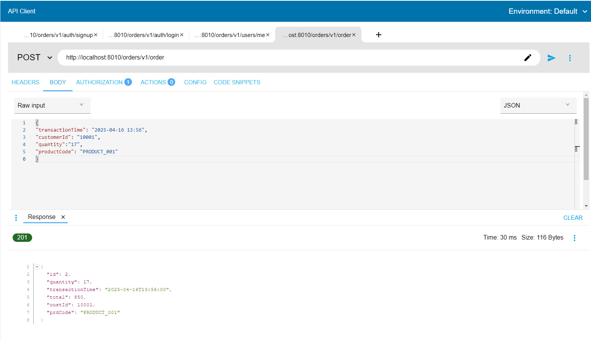
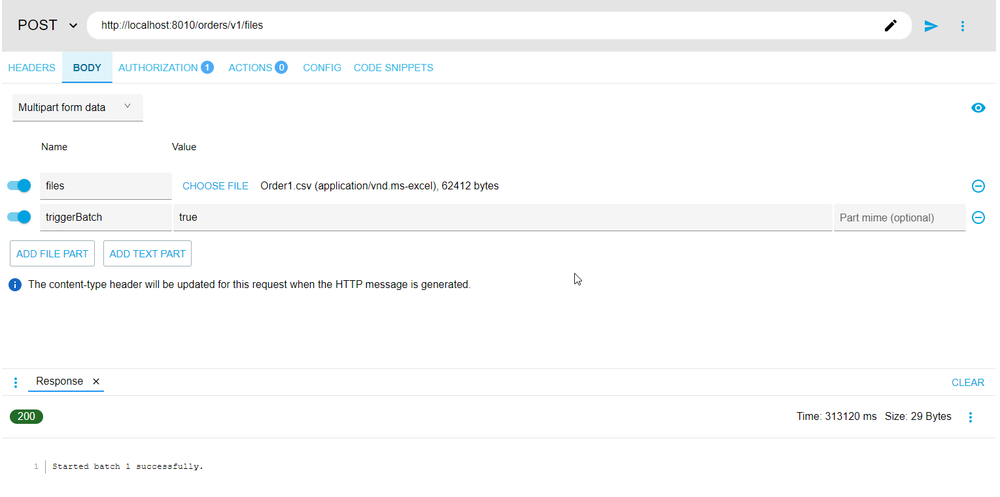
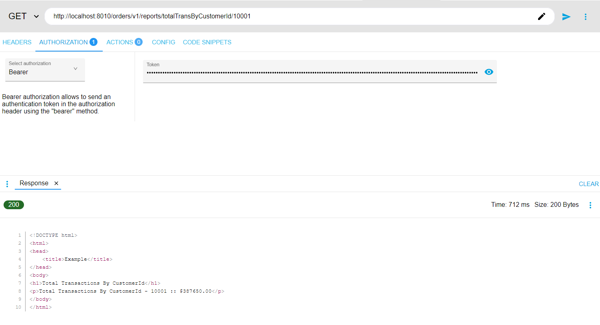
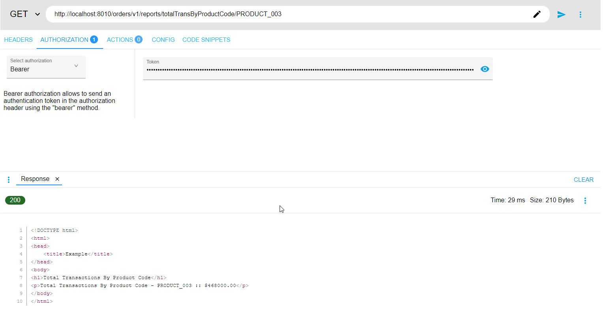
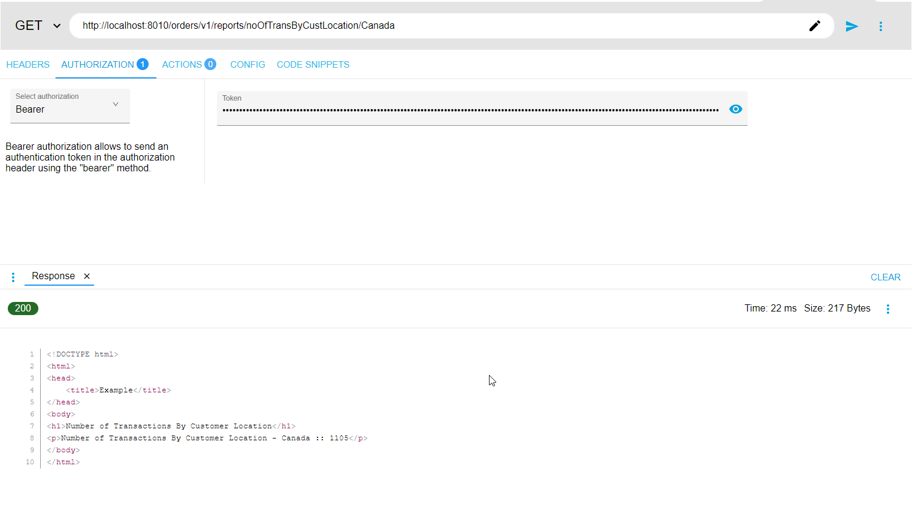

# Order Management Application

This is an Order Management System built with JDK11, Spring Boot SpringBatch,JWT Authentication,H2SQL DB,JPA,Spring Thymeleaf reports.
The application provides secure authentication, batch processing, database management, and reporting features.
Authorized users may be able to place the single or multiple order,that validated against the business rules and securely stored in H2SQL DB.

## Table of contents

* [About this project](#about-this-project)
* [Technologies Used](#tech-used)
* [Project Features](#project-features)
* [Project Installation & Setup](#project-setup)
* [Project Configuration](#configuration)
* [API Endpoints](#project-endpoints)
* [Project ScreenPrints](#project-screenprints)

##  About this project
This project is a Micro-Service Rest API driven application,secured with JWT Authentication, using Spring boot.
This allows the user to place the orders.
User needs to create an account / Sign-up, inorder to access this Application.
JWT Authentication will validate the users upon sign-up and login and generate a Bearer token for them to use.

As a user you can place an order.
Order can be of a single or multiple transactions.
Once the order is placed, the system will validate and store it in the DB.
User will receive the Success response with the newly created order detail, if its a valid order.
User will receive error message, if the placed order is invalid.
User may be able to generate the report.
To perform the above tasks, the user should use the JWT Bearer token in the "Authorization" header.

##  Technologies Used

- JDK 11 - Compiling and running Java applications
- Spring Boot - Developing microservices
- Maven - Build automation tool
- Spring Batch - Batch processing framework for handling large volumes of transactions
- JWT Authentication
- H2SQL Database
- JPA - Java Persistence API for DB interaction
- Thymeleaf Reports Template for generating reports
- Spring Security  
- JUnit - Dev testing
- RESTful API - API architecture for handling REST API operations

 ##  Project Features
- Secure microservices using JWT authentication
- Batch processing of orders using Spring Batch
- Reports generation with Thymeleaf templates
- RESTful API for interacting with the system
- Unit testing using JUnit + Mockito
 ##  Project Installation & Setup
 

 ###  Prerequisites
 - Java Development Kit (JDK) 11 or later.
 - Install Maven
 - IDE like IntelliJ IDEA or Eclipse.
 - Install IntelliJ Lombok plugin

 
 1. Clone the repository :
    - git clone https://github.com/ShemidaArthurN/orderManagement.git
    - Navigate to the project directory: cd orderManagement
2. Update the below configuration in application.properties with a local folder location.
  eg. if the folder location is in C:/Test/Batches, create 2 folders namely "input" and "archive" and used the below pattern for assigning values to the below properties.
  "file:///C:/Test/Batches/input" and "file:///C:/Test/Batches/archive" respectively.

    -  orders.input-folder
    -  orders.archive-folder
3. Build the project:mvn clean install
4. Run the application:mvn spring-boot:run
5. Access APIs:
    - Application runs on http://localhost:8010/
    - Use tools like Postman or Curl or Advance Rest Client to test APIs.
    - Sample File for Bulk transaction can be found under 
    - https://github.com/ShemidaArthurN/orderManagementApp/tree/main/src/main/resources/input/Order1.csv

 ##  Project Configuration
 ###  Application Properties
 The following configurations are defined in application.properties:

##### H2 Database Configuration
- spring.datasource.url=jdbc:h2:mem:orderMgmtdb
- spring.datasource.username=sa
- spring.datasource.password=
- spring.datasource.driverClassName=org.h2.Driver
- spring.jpa.database-platform=org.hibernate.dialect.H2Dialect

#####  JWT Configuration
- Secret can be generated by running the "com.example.orderManagement.keyGen.HMACKeyGenerator" class inside the project.
 - jwt.secret=YourSecretKey
 - jwt.expiration.time=3600000

##### Spring Batch Settings
- spring.batch.job.enabled=true
 
 
##### Batch Job Configuration
- ItemReader: Reads orders from a CSV file.
- ItemProcessor: Validates and processes order data.
- ItemWriter : Writes the Orders to the DB.

 ##  API Endpoints

| Method | End Point             | Description                                                                                      | Authentication/Token  |  
| ------------- |-----------------------|--------------------------------------------------------------------------------------------------| -------------  |
| POST  | /orders/v1/auth/signup | User Signup using JWT token   Body Parameter  email,password,fullName | No Token Needed
| POST  | /orders/v1/auth/login | User Login                                                                                       |As response, System will generate the Bearer Token using JWT 
| POST  | /orders/v1/order      | Place an Single order   Body Parameter  transactionTime,customerId,quantity,productCode    |Need Bearer Token
| POST  | /orders/v1/files      | Upload Bulk orders in files                                                                      |Need Bearer Token
| POST  | /orders/v1/batches    | Point the local directory of the file that needs to process                                      |Need Bearer Token
| GET  | /orders/v1/reports/totalTransByCustomerId/{customerId} | Total Txn by a Customer                                                                          |Need Bearer Token
| GET  | /orders/v1/reports/totalTransByProductCode/{productCode} | Total Txn of Product                                                                             |Need Bearer Token
| GET  | /orders/v1/reports/noOfTransByCustLocation/{location} | Total Txn of a location                                                                          |Need Bearer Token

##  Project ScreenPrints

SignUp : 

Login : 

Place an Order :

Batch Transaction

Reports : 

Transaction based on customer 

Transaction based on Product 

Transaction based on Location
